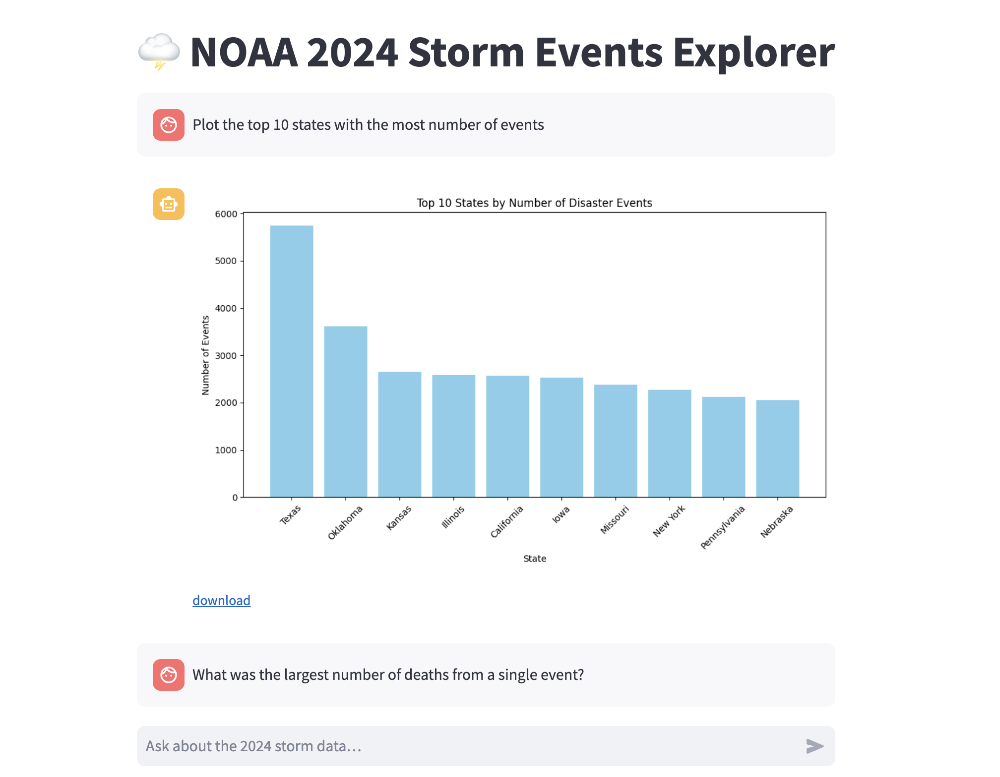

# 🌪️ Storm Events Chatbot

This Streamlit app lets you explore U.S. storm event data using **natural language** questions. Stored in AWS S3 as a Delta Lake table, the data is now queried via **DuckDB** from Parquet files. The chatbot uses **PandasAI** and **LiteLLM** to run queries against a DataFrame using the **ChatGPT o4-mini** model. You can try the app [here](https://stormy-chat.streamlit.app/)!



---

## 🔧 Tech Stack

* **PandasAI** – runs Python code generated from user prompts on a real DataFrame
* **LiteLLM** – wraps access to `gpt-4o-mini` for low-latency local or hosted LLM usage
* **DuckDB** – fast, in-memory SQL engine used to query Delta-format Parquet files
* **Streamlit** – interactive web app framework for Python
* **AWS S3** – source of the original Delta Lakehouse data

---

## 📊 Example Questions

Ask questions like:

* *Plot the top 10 states with the most number of events.*
* *What was the largest number of deaths from a single event?*
* *How much property damage was caused by hurricanes?*
* *Plot the total deaths by event type in 2024.*
* *Plot frequency of hurricanes by category(1,2,3,4,5).*

---

## 🚀 Setup Instructions

1. **Install dependencies**

```bash
pip install -r requirements.txt
```

2. **Input S3 details**

In streamlit\_app.py, replace the values with your AWS S3 bucket information:

```python
bucket   = "ibhs-lakehouse-poc-1746937696"
prefix   = "delta/storm_events/"
region   = "us-east-1"
```

3. **Run the app**

```bash
streamlit run streamlit_app.py
```

---

## 🔐 Environment Variables

Use `.streamlit/secrets.toml` or `.env` to provide:

```toml
[aws]
AWS_ACCESS_KEY_ID = "..."
AWS_SECRET_ACCESS_KEY = "..."

[openai]
OPENAI_API_KEY = "..."
```

---

## 📁 Data Source

This app uses 2024 U.S. storm event data from [NOAA](https://www.ncei.noaa.gov/pub/data/swdi/stormevents/csvfiles/), loaded into a Delta Lakehouse.

---

## 📌 Notes

* PandasAI directly powers the chatbot logic.
* LLM responses are handled by LiteLLM with ChatGPT `gpt-4o-mini` as the backend.
* The entire pipeline runs locally for fast and cost-efficient prototyping.

---
